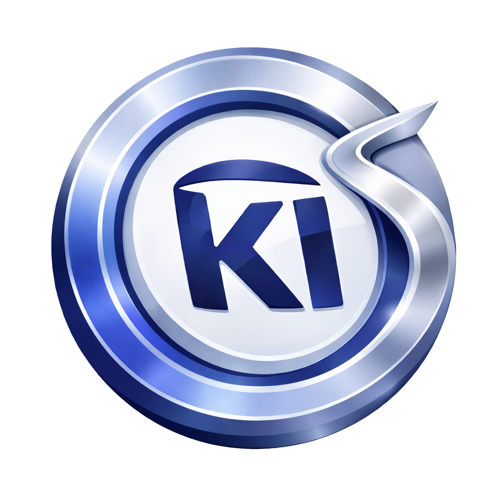
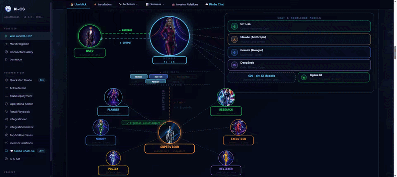
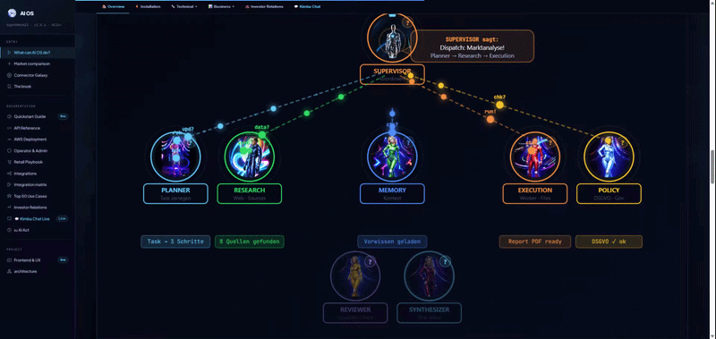
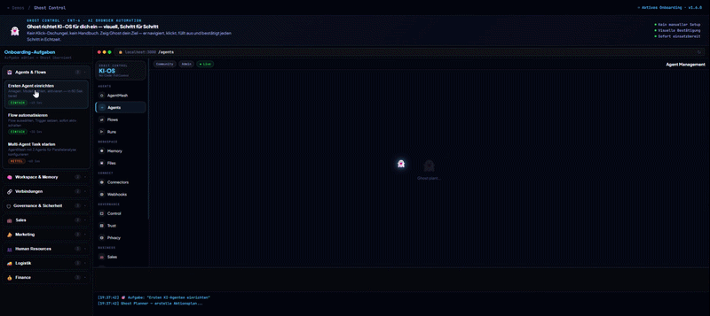
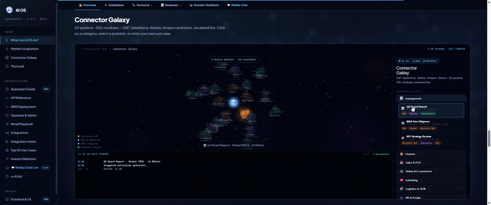
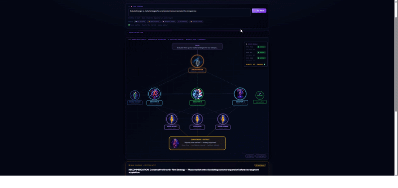
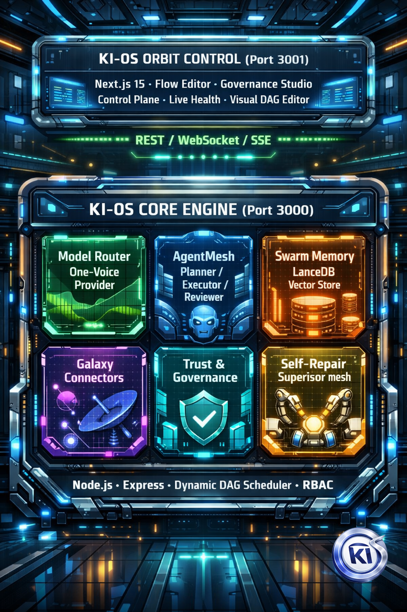

<div align="center">



<h1>KI-OS — The AI Operating System</h1>

<p><strong>The definitive runtime layer for models, agents, memory, and autonomous execution.</strong><br/>
We do not integrate AI tools. We are the sovereign system that runs them.</p>

[](https://github.com/KI-OS-org/ki-os/releases)
[](LICENSE-AGPL)
[](https://ki-os.org/book.html)
[](#)

<br/>

[Website](https://ki-os.org) · [Live Demo](https://ki-os.org) · [Documentation](docs/COMMUNITY_API.md) · [Contact Sales](mailto:enterprise@ki-os.org) · [The Book](https://ki-os.org/book.html)

</div>

---

## Current Documentation

For the current verified system view, start with `docs/CURRENT_STATE.md`.
For historical sprint, release, and handoff material, use `docs/ARCHIVE_GUIDE.md` before relying on older documents.

---

## The Architectural Manifesto

> *"This book is an invitation. Not to treat KI-OS as a tool. But to treat it as operational intelligence."*

The AI Era demands a massive shift from pure experimentation to relentless, scalable execution. KI-OS is the foundational layer that turns generative noise into robust corporate infrastructure. By fully abstracting models, agents, memory, and governance, KI-OS creates an immutable, highly stable environment for autonomous work at enterprise scale.

**We are moving past the era of prompt engineering. We are entering the era of AI systems engineering.**

---

## The End of AI Chaos

Most organizations don't have an AI problem. They have a **catastrophic AI chaos problem** — isolated tools, zero coordination, automations that break with every model update.

| BEFORE | AFTER |
|---|---|
| 12 disconnected tools | 1 unified execution system |
| 5 fragile APIs | Swarm intelligence |
| Broken workflows | Complete data sovereignty |
| Zero memory | Production-grade workflows |

KI-OS sits securely between your workforce and the fragmented AI landscape — routing intelligently, remembering context, enforcing governance, and orchestrating agents that **actually finish what they start**.

> *"AI without orchestration is noise. AI with KI-OS becomes infrastructure."*

---

## How It Works — The Five Core Pillars

### 1 — One Voice Agent: Multi-Model Routing

KI-OS evaluates every prompt in real-time and routes it to the optimal model — based on cost, latency, and reasoning depth. One unified interface. Any model. Automatic fallback.

<div align="center">
  
  <br/><br/>
  <a href="https://ki-os.org">▶ Live Demo on ki-os.org</a>
</div>

| Capability | Status |
|---|---|
| Multi-Model Execution Engine | BUILT-IN |
| Intelligent Real-Time Model Routing | ACTIVE |
| Cost, Latency and Quality Optimization | FULLY AUTOMATED |
| Model Failure Fallback System | SELF-HEALING |
| Parallel Multi-Model Execution | SUPPORTED |

**Flagship Fleet:** OpenAI GPT & o1 · Anthropic Claude · Google Gemini · DeepSeek V & R · Qwen Max · Meta Llama · Local / On-Premises (air-gapped)

---

### 2 — AgentMesh: Multi-Agent Orchestration

A living, breathing multi-agent runtime engineered for complex, multi-stage enterprise operations. Planner → Executor → Reviewer roles work in parallel with self-healing loops and autonomous agent-to-agent communication.

<div align="center">
  
  <br/><br/>
  <a href="https://ki-os.org">▶ Live Demo on ki-os.org</a>
</div>

| Capability | Status |
|---|---|
| Planner, Executor and Reviewer Roles | BUILT-IN |
| Supervisor Mesh Layer | SELF-RECOVERY |
| Self-Healing and Repair Loops | ADD-ON / INTEGRATED |
| Multi-Agent Parallel Runs | YES |
| Long-Running Stateful Workflows | YES |
| Autonomous Agent-to-Agent Communication | YES |

---

### 3 — Ghost Control: Autonomous Browser Agent

KI-OS v1.23.0 includes Ghost Control as a core autonomous browser agent pipeline. A Planner decomposes goals into steps, an Executor performs real browser actions, and a Vision module validates each result. If validation fails, the system re-plans automatically.

<div align="center">
  
  <br/><br/>
  <a href="https://ki-os.org/ghost-demo.html">▶ Interactive Ghost Control Demo →</a>
</div>

| Capability | Status |
|---|---|
| Goal → Plan decomposition (Planner Agent) | BUILT-IN |
| Browser action execution (Executor Agent) | BUILT-IN |
| Vision-based step verification | BUILT-IN |
| Automatic re-planning on failure | SELF-HEALING |
| No Selenium / no Playwright dependency | NATIVE |

---

### 4 — Galaxy Connectors: Enterprise Execution

Universal connector layer that bridges AI agents to any enterprise system — from SAP to Slack to your custom webhook — without writing glue code.

<div align="center">
  
  <br/><br/>
  <a href="https://ki-os.org">▶ Live Demo on ki-os.org</a>
</div>

| Category | Systems |
|---|---|
| Enterprise AI | SAP Joule · Salesforce Agentforce · M365 Copilot · ServiceNow GenAI |
| ERP | SAP S/4HANA · SAP R/3 (via Middleware Bridge) · Oracle ERP |
| CRM | Salesforce · HubSpot · Pipedrive · Microsoft Dynamics |
| Collaboration | Jira · Confluence · Slack · Teams · Google Workspace |
| Automation | n8n · Zapier · Make · Custom Webhooks |
| Data & Analytics | Snowflake · BigQuery · Databricks · S3 · Azure Blob |

---

### 5 — Swarm Intelligence: The Memory Layer

KI-OS memory is a hybrid architecture. The Community Edition provides local data sovereignty for individual use. The Business Edition runs a self-hosted central KI-OS server — your team shares one memory, your data never leaves your infrastructure. Both editions are built on the same sovereignty principle: **your data stays where you put it.**

<div align="center">
  
  <br/><br/>
  <a href="https://ki-os.org">▶ Live Demo on ki-os.org</a>
</div>

| Capability | Status |
|---|---|
| Persistent Vector Memory Store (LanceDB) | BUILT-IN |
| Cross-Run Learning and Pattern Reinforcement | YES |
| Shared Swarm Memory Across All Agents | YES |
| Confidence Scoring and Anti-Pattern Detection | YES |

---

## Governance & Trust: Adaptable Compliance

> *"Governance by Design — The five building blocks: Governance Check, Privacy Mask, Memory Retrieve, Connector Call, Approval Step."*

The EU AI Act framework is natively built-in but remains fully adaptable. KI-OS allows you to self-configure Governance and Trust settings according to your specific compliance requirements. Every prompt, agent decision, and API call is filtered through your customized policy engine — including military-grade PII masking and human-in-the-loop approval gates.

### Compliance & Certifications

| Standard | Status | Details |
|---|---|---|
| **DSGVO (GDPR)** | ✅ Compliant | Data sovereignty, PII masking, audit logs, right to erasure |
| **EU AI Act** | ✅ Adaptable | Basic (Community) → High-Risk Ready Art. 9–15 (Enterprise) |
| **ISO 27001** | 🔄 In Progress | Security controls implemented, certification pending |
| **SOC 2 Type II** | 🔄 Planned | 2026 Q3 target |
| **BSI C5** | 🔄 Planned | 2026 Q4 target |

### Security Features

- ✅ **Data Sovereignty:** All data stays on your hardware (Community/Business) or explicitly contracted managed hosting (Enterprise)
- ✅ **PII Masking:** Military-grade personally identifiable information masking with reversible tokens
- ✅ **Audit Logs:** Complete NDJSON audit trail for all agent decisions and API calls
- ✅ **Access Control:** SQLite + JWT (Community), OAuth 2.0 / OIDC / SAML 2.0 (Enterprise)
- ✅ **Multi-Tenant Isolation:** Database-level isolation for Enterprise deployments
- ✅ **Encryption:** AES-256 for data at rest, TLS 1.3 for data in transit

---

## 🎉 NEW in v1.28.0 — Agent-Revolution

**Hierarchische Teams, Browser-Automation & Auto-Learning**

### 🌐 Browser-Use Tool (Playwright + Firecrawl)

**Autonome Browser-Interaktion für KI-Agenten.**

KI-OS kann jetzt Webseiten öffnen, navigieren, klicken, Text eingeben, Screenshots machen und Inhalte scrapen. Vollständig integriert mit Firecrawl für Web-Suche und Scraping.

**Features:**
- ✅ **8 Browser-Tools:** `navigate`, `click`, `fill`, `screenshot`, `scroll`, `wait`, `scrape`, `search`
- ✅ **Security:** Domain-Allowlist, Rate-Limiting (10/Min), Timeout (30s)
- ✅ **Privacy:** Audit-Redaction für sensible Daten
- ✅ **Firecrawl-Integration:** Web-Scraping und Websuche
- ✅ **Graceful Shutdown:** Cleanup-Hooks bei Server-Stop

**Use-Cases:**
- Wettbewerbsanalyse (Preise scrapen)
- Formular-Ausfüllen (Automatisierte Anmeldungen)
- Screenshot-Dokumentation (Compliance)
- Web-Research (Über einfache Suche hinaus)

```bash
# Installation
npm install playwright
npx playwright install chromium

# .env (optional für Scraping)
FIRECRAWL_API_KEY=fc_xxx
```

---

### 🧠 Reflection-Engine (Auto-Optimization)

**Automatische Selbst-Optimierung nach jedem Agent-Run.**

KI-OS bewertet jetzt automatisch jeden Run und generiert Learnings für zukünftige Tasks. Das System lernt kontinuierlich dazu und wird mit jeder Ausführung besser.

**Features:**
- ✅ **Scorecard:** Quality (0.4), Cost (0.2), Latency (0.2), Tool-Choice (0.2)
- ✅ **LLM-basierte Reflection:** "Was gut? Was schlecht? Nächste Zeit besser!"
- ✅ **Swarm Memory Integration:** Learnings automatisch speichern
- ✅ **API-Endpoints:** `/api/reflection/evaluate`, `/api/reflection/learnings`, `/api/reflection/stats`
- ✅ **AgentMesh-Integration:** Automatisch nach jedem Run

**Learning-Format:**
```json
{
  "whatWorked": ["Web-Suche war präzise", "Memory-Recall relevant"],
  "whatFailed": ["Provider-Wahl zu teuer"],
  "nextTime": ["Verwende Qwen für ähnliche Tasks"],
  "savedCosts": 0.50,
  "improvedLatency": 2000
}
```

---

### 📹 Session-Recording (mit Compression)

**Vollständige Aufzeichnung + Replay von Agent-Sessions.**

Jede Session wird aufgezeichnet, zu Learnings komprimiert und kann bei Bedarf replayt werden. Perfekt für Debugging, Training und Compliance.

**Features:**
- ✅ **Full Session Recording:** Alle Steps, Events, Costs
- ✅ **LLM-Compression:** Prompt → Learning (Zusammenfassung)
- ✅ **Learning-Extraction:** `whatWorked`, `whatFailed`, `nextTime`
- ✅ **Replay-Funktionalität:** Debugging von fehlgeschlagenen Runs
- ✅ **Auto-Cleanup:** 30 Tage Retention

**Use-Cases:**
- Debugging von fehlgeschlagenen Runs
- Training neuer Agenten
- Compliance-Audits
- Performance-Optimierung

---

### 👥 Hierarchical Agents (Manager/Worker/Specialist)

**Team-basierte Agent-Architektur für komplexe Tasks.**

Statt einzelner Agenten arbeitet jetzt ein ganzes Team: Manager plant und delegiert, Worker führen aus, Specialists bringen Domain-Expertise ein.

**Rollen:**
- ✅ **MANAGER:** Empfängt Task, plant Subtasks, delegiert, synthetisiert Ergebnis
- ✅ **WORKER:** Führt generische Tasks aus (günstig, schnell)
- ✅ **SPECIALIST:** Domain-Experte (research, coding, writing, review)

**Bidding-System:**
- Worker bieten auf Tasks (Kosten vs. Qualität)
- Economic Router entscheidet basierend auf Score
- Winner nimmt Task

**API:**
```bash
POST /api/hierarchical/run      # Run starten
GET  /api/hierarchical/teams    # Verfügbare Teams
GET  /api/hierarchical/stats    # Team-Statistiken
```

**Use-Cases:**
- Marketing-Plan erstellen (Researcher + Writer + Reviewer)
- Code-Review (Coder + Reviewer + Tester)
- Data-Analysis (Analyst + Visualizer + Presenter)

---

## 📊 v1.28.0 Stats

| Metrik | Wert |
|--------|------|
| **Neue Features** | 4 |
| **Neue Dateien** | 19 |
| **Tests** | 55/55 bestanden ✅ |
| **Production-Ready** | ✅ Ja |
| **Developed by** | KIMBA |

---

## Edition Overview

KI-OS comes in three editions — each built on the same codebase, differentiated by scale, deployment, and compliance requirements.

### Community — Free & Open Source
**For developers, researchers, and individual builders.**

Local deployment only. Full AI operating system capabilities on your own hardware. **No data ever leaves your machine.** Licensed under AGPL-3.0.

> *"Build on the same runtime that powers enterprise deployments — without cost, without limits on what you create."*

### Business — Team Scale *(coming v2.0)*
**For teams and growing organizations.**

You run **your own** central KI-OS server — on-premise or in your own cloud. Team members connect to it. **All data stays in your infrastructure.** We provide the software and a license key. Nothing else.

The license key is validated periodically against `license.ki-os.org` — only the key is checked, never your data, never your agents, never your memory.

> *"Same data sovereignty promise. Now for your whole team. Your server. Your data. Our software."*

### Enterprise — Compliance-Ready *(coming v2.0)*
**For regulated industries and large organizations.**

Like Business — self-hosted by default. Optionally: managed hosting by KI-OS (explicitly contracted, EU data residency). OAuth 2.0 / OIDC / SAML 2.0, Multi-Tenant isolation, EU AI Act High-Risk compliance (Art. 9–15), dedicated SLA and support.

> *"Governance by design. Compliance out of the box. Your data — wherever you need it."*

---

## Edition Matrix (v1.28.0)

**Alle Editionen basieren auf dem gleichen Codebase — unterscheiden sich durch Skalierung, Deployment und Compliance.**

| Capability | Community | Business | Enterprise |
| :--- | :---: | :---: | :---: |
| **Core Runtime** | | | |
| Multi-Model Dynamic Routing | ✅ | ✅ | ✅ |
| Create Agents | ✅ Unlimited | ✅ Unlimited | ✅ Unlimited |
| Concurrent Agent Runs | 3 (local HW) | Unlimited | Unlimited Swarms |
| One Voice Agent (Multi-Model Routing) | ✅ | ✅ | ✅ |
| AgentMesh Multi-Agent Orchestration | ✅ | ✅ | ✅ |
| Ghost Control (Browser Automation) | ✅ | ✅ | ✅ Full |
| A2A Protocol (Agent-to-Agent) | ✅ | ✅ | ✅ + Enterprise Hub |
| **v1.28.0 NEW: Browser-Use Tool** | | | |
| Browser Automation (Playwright) | ✅ 8 Tools | ✅ 8 Tools | ✅ 8 Tools + Advanced |
| Web Scraping (Firecrawl) | ✅ Basic | ✅ Standard | ✅ Premium |
| Domain Allowlist + Rate-Limit | ✅ | ✅ | ✅ + Custom Rules |
| **v1.28.0 NEW: Hierarchical Agents** | | | |
| Manager/Worker/Specialist Roles | ✅ | ✅ | ✅ + Custom Roles |
| Bidding-System | ✅ Basic | ✅ Standard | ✅ + Priority Bidding |
| Economic Router | ✅ | ✅ | ✅ + Custom Policies |
| **v1.28.0 NEW: Reflection-Engine** | | | |
| Auto-Optimization per Run | ✅ | ✅ | ✅ + Fleet Learning |
| Scorecard (Quality/Cost/Latency) | ✅ | ✅ | ✅ + Custom Metrics |
| Swarm Memory Integration | ✅ local | ✅ shared | ✅ fleet-wide |
| **v1.28.0 NEW: Session-Recording** | | | |
| Full Session Recording | ✅ 7 days | ✅ 90 days | ✅ unlimited + export |
| LLM-Compression to Learning | ✅ | ✅ | ✅ + Team Sharing |
| Replay + Debugging | ✅ | ✅ | ✅ + Audit Trail |
| **Memory & Learning** | | | |
| Swarm Memory (LanceDB, ACO Decay) | ✅ local | ✅ shared | ✅ fleet-wide |
| Memory Sharing API | ✅ | ✅ | ✅ |
| Learned Routing (Outcome Scorecard) | ✅ local | ✅ team | ✅ fleet |
| **Agent Operations** | | | |
| Dynamic Roles + Capability Discovery | ✅ | ✅ | ✅ |
| Structured Handoff Protocol | ✅ JSON | ✅ +UI Viewer | ✅ +Approval Workflow |
| **Galaxy Connectors** | | | |
| Galaxy Connectors (Basic) | ✅ 10+ | ✅ 20+ | ✅ 30+ |
| Native Enterprise AI Connectors | ❌ | ❌ | ✅ (SAP Joule, Salesforce Agentforce) |
| ERP Connectors (SAP S/4HANA, Oracle) | ❌ | ❌ | ✅ |
| CRM Connectors (Salesforce, HubSpot) | ❌ | ✅ Selectable | ✅ Full |
| Collaboration (Jira, Slack, Teams) | ✅ Basic | ✅ Standard | ✅ Premium |
| Automation Platforms | ✅ n8n (self-hosted) | ✅ n8n (self-hosted), Zapier, Make, Adobe Workfront, Microsoft Power Automate | ✅ n8n (self-hosted), Zapier, Make, Adobe Workfront, Microsoft Power Automate |
| Social Media (Instagram, Facebook, TikTok, LinkedIn) | ❌ | ✅ Instagram, Facebook, TikTok, LinkedIn (all features) | ✅ Instagram, Facebook, TikTok, LinkedIn (all features + Ads Manager) |
| E-Commerce Platforms | ❌ | ✅ Shopify, WooCommerce, Magento, PrestaShop, Shopware | ✅ Shopify, WooCommerce, Magento, PrestaShop, Shopware |
| Payment Providers | ❌ | ✅ Stripe, PayPal, Square, Mollie, Adyen | ✅ Stripe, PayPal, Square, Mollie, Adyen |
| Marketing Platforms | ❌ | ✅ Mailchimp, ActiveCampaign, HubSpot, Marketo, Pardot | ✅ Mailchimp, ActiveCampaign, HubSpot, Marketo, Pardot |
| ERP Systems | ❌ | ✅ SAP, Oracle NetSuite | ✅ SAP, Oracle NetSuite |
| CRM Systems | ❌ | ✅ HubSpot CRM, Pipedrive, Salesforce, Zoho, Microsoft Dynamics | ✅ HubSpot CRM, Pipedrive, Salesforce, Zoho, Microsoft Dynamics |
| PIM/DAM Systems | ❌ | ✅ Akeneo, Pimcore, Bynder | ✅ Akeneo, Pimcore, Bynder |
| Analytics Platforms | ❌ | ✅ Google Analytics, BigQuery, Snowflake, Adobe Analytics | ✅ Google Analytics, BigQuery, Snowflake, Adobe Analytics |

> **✓ Integration Methods:** All platforms support API integration OR webhook triggers. Social Media platforms require respective API access tokens (Meta Developer, TikTok API, LinkedIn API). n8n is self-hosted in Community Edition.

---

## **Governance & Compliance**

| Capability | Community | Business | Enterprise |
|------------|-----------|----------|------------|
| Governance Module (Policy Packs) | Community pack | Custom YAML | Custom YAML + Audit |
| Risk Tiers (LOW/MEDIUM/HIGH/CRITICAL) | ✅ | ✅ | ✅ |
| Audit Events (NDJSON) | ✅ local | ✅ persistent | ✅ exportable |
| EU AI Act Compliance | Basic | Adaptable | High-Risk (Art. 9–15) |
| PII Masking | Basic | ✅ Pro | ✅ Military-Grade |
| **Data & Sovereignty** | | | |
| Data stays on your hardware | ✅ always | ✅ always | ✅ always |
| Optional managed hosting | ❌ | ❌ | ✅ explicitly contracted |
| License key validation | ❌ No key needed | ✅ key only | ✅ key only |
| **Auth & Deployment** | | | |
| Auth (SQLite + JWT) | ✅ | ✅ | ✅ |
| OAuth 2.0 / OIDC / SAML 2.0 | ❌ | ❌ | ✅ |
| Multi-Tenant Isolation | ❌ | ❌ | ✅ |
| Deployment | Local | Self-hosted | Self-hosted/managed |
| **SDK & Tooling** | | | |
| Python SDK (`pip install kios`) | ✅ | ✅ | ✅ |
| Mobile App (React Native) | ❌ | ✅ Commercial | ✅ Commercial |
| C-Deck Command Cockpit | ✅ | ✅ | ✅ |

---

## 📸 Feature Screenshots & Demos

### 🌐 Browser-Use Tool

**Screenshots:**
- [Browser Navigation Demo](Web/browser-navigate.png) *(coming)*
- [Web Scraping Example](Web/browser-scrape.png) *(coming)*

**Live Demo:** [https://ki-os.org/browser-demo.html](https://ki-os.org) *(coming)*

---

### 🧠 Reflection-Engine

**Screenshots:**
- [Scorecard Dashboard](Web/reflection-scorecard.png) *(coming)*
- [Learning Timeline](Web/reflection-learnings.png) *(coming)*

**API Example:**
```bash
curl -X POST http://localhost:3000/api/reflection/evaluate \
  -H "Content-Type: application/json" \
  -d '{"runId": "xxx", "task": "...", "output": "..."}'
```

---

### 👥 Hierarchical Agents

**Screenshots:**
- [Team Structure](Web/hierarchical-team.png) *(coming)*
- [Bidding System](Web/hierarchical-bidding.png) *(coming)*

**Live Demo:** [https://ki-os.org/hierarchical-demo.html](https://ki-os.org) *(coming)*

---

### 📹 Session-Recording

**Screenshots:**
- [Session Timeline](Web/session-timeline.png) *(coming)*
- [Replay View](Web/session-replay.png) *(coming)*

**API Example:**
```bash
curl http://localhost:3000/api/sessions/run-123
```

---

## Installation

**Requirements:** Node.js 22 LTS · **NO API KEY REQUIRED** for Community Edition

> **Node.js is installed automatically** by the setup scripts if not present.
> **Community Edition runs completely locally without any API keys.** Add keys for cloud models when ready.

### Windows (Recommended)

```
1. Download ZIP from https://github.com/KI-OS-org/ki-os/releases/latest
2. Extract → double-click setup.bat    (installs Node.js + dependencies)
3. Double-click START-community.bat    (starts KI-OS → http://localhost:3000)
```

### Linux / macOS

```bash
# 1. Download & extract or clone
git clone https://github.com/KI-OS-org/ki-os.git
cd ki-os/dist/community

# 2. Run setup (installs Node.js 22 if missing, installs dependencies)
bash setup.sh

# 3. Start
bash KI-OS-Community.sh
# → http://localhost:3000
```

### Configure API Keys (Optional)

Add at least one provider key to `.env` (copy from `.env.example`):

```env
ANTHROPIC_API_KEY=sk-ant-...      # Anthropic Claude
OPENAI_API_KEY=sk-...             # OpenAI GPT / o1
OPENROUTER_API_KEY=sk-or-...      # 600+ models, single key
GEMINI_API_KEY=AIza...            # Google Gemini
```

> **Tip:** [OpenRouter](https://openrouter.ai) gives you Claude, GPT, Gemini, DeepSeek, Qwen and 600+ models with a single API key — ideal for getting started.

---

### Docker

```bash
cp .env.example .env   # add your API keys
docker compose up -d
# → http://localhost:3000
```

Full `docker-compose.yml` included — production-grade with health checks, persistent volume, and auto-restart:

```yaml
services:
  ki-os:
    image: ghcr.io/ki-os-org/ki-os:latest
    ports: ["3000:3000"]
    environment:
      - ANTHROPIC_API_KEY=${ANTHROPIC_API_KEY}
      - KI_OS_EDITION=community
    volumes:
      - ki-os-data:/app/data
    restart: unless-stopped
    healthcheck:
      test: ["CMD", "wget", "-qO-", "http://localhost:3000/health"]
      interval: 30s
      retries: 3
```

---

### Troubleshooting

| Problem | Solution |
|---|---|
| Port already in use | `START-community.bat` kills existing processes automatically |
| No API key set | **Community runs without keys!** Add keys for cloud models only |
| Node version error | Run `setup.bat` / `setup.sh` — auto-installs Node.js 22 LTS |
| `npm install` fails | Delete `node_modules/` and retry |
| UI doesn't load | Check that port 3000 is not blocked by firewall |

---

## API Reference

Base URL: `http://localhost:3000` · All responses: `application/json` · Every response includes `x-trace-id`

### System

```bash
GET  /health     # System health — runtime, memory, connectors, supervisor
GET  /ready      # Readiness probe (200 = ready)
GET  /status     # Full observability snapshot
GET  /metrics    # Runtime metrics — requests, tokens, latency
```

```bash
curl http://localhost:3000/health
# → { "status": "ok", "edition": "community", "checks": { "runtime": {...}, "connectors": { "total": 23 } } }
```

### Chat

```bash
POST /chat
```
```json
{ "message": "Summarize the Q1 sales report", "conversationId": "session-42" }
```
```json
{ "success": true, "reply": "...", "model": "claude-sonnet-4-5", "provider": "anthropic", "tokens": { "input": 18, "output": 94 } }
```

### AgentMesh — Multi-Agent Runs

```bash
POST   /api/agentmesh/runs          # Start a multi-agent run (Community: 3 concurrent / local HW)
GET    /api/agentmesh/runs          # List all runs
GET    /api/agentmesh/runs/:runId   # Get run status + step log
DELETE /api/agentmesh/runs/:runId   # Cancel run
```

### Sessions — Recording & Replay

```bash
GET    /api/sessions                # List all recorded sessions
GET    /api/sessions/:runId         # Get session recording
DELETE /api/sessions/:runId         # Delete session
GET    /api/handoff/:runId          # Structured handoff object for a run
```

### Dynamic Roles

```bash
GET    /api/roles                   # List all agent roles + capabilities
GET    /api/roles/:name             # Get specific role
POST   /api/roles/recommend         # Get recommended roles for a task description
```

### Governance

```bash
GET    /api/governance/status       # Current governance status (edition, policy pack)
GET    /api/governance/policy       # Active policy pack (allowed tools, cost limits)
POST   /api/governance/audit        # Write audit event
```

### Learned Routing

```bash
GET    /api/scorecard               # Outcome scorecard per provider/task type
POST   /api/scorecard/record        # Record a run outcome
GET    /api/scorecard/recommend     # Get routing recommendation for task + budget
```

### Autonomous Feature Intelligence

```bash
POST   /api/intelligence/scan                  # Scan AI sources for new features
GET    /api/intelligence/proposals             # List sprint proposals
PATCH  /api/intelligence/proposals/:id         # Update proposal status (pending → approved)
```

### License

```bash
GET    /api/license/status    # Current tier (community / business), limits, validUntil
POST   /api/license/refresh   # Trigger online validation against license.ki-os.org
```

```bash
curl -X POST http://localhost:3000/agentmesh/runs \
  -H "Content-Type: application/json" \
  -d '{ "task": "Research competitors and write a report", "agentIds": ["researcher","writer"], "maxParallel": 3 }'
```

### Memory (Vector Search)

```bash
POST /memory          # Store a fact
POST /memory/search   # Semantic search across all stored memory
GET  /memory/:key     # Retrieve specific entry
DELETE /memory/:key   # Delete entry
```

### Routing

```bash
POST /routing/resolve      # Preview which model KI-OS would select
GET  /routing/scorecards   # Live performance scores per provider
GET  /routing/decisions    # Full routing decision history
```

### Governance & Privacy

```bash
POST /governance/simulate   # Test a message against your policy engine
POST /privacy/analyze       # Detect PII in text
POST /privacy/mask          # Replace PII with tokens
POST /privacy/demask        # Restore original values
```

### Error Format

```json
{ "success": false, "error": "enterprise_only", "message": "This feature requires Enterprise Edition" }
```

| Code | Meaning |
|---|---|
| 200 | Success |
| 400 | Bad request |
| 403 | Enterprise only |
| 429 | Rate limited |
| 503 | Service down — check `/health` |

Full API reference: [docs/COMMUNITY_API.md](docs/COMMUNITY_API.md)

---

## Operator Guide

### Health & Monitoring

```bash
# Health check
curl http://localhost:3000/health

# Full status snapshot
curl http://localhost:3000/status

# Runtime metrics
curl http://localhost:3000/metrics
```

### Authentication

All API endpoints require identity headers:

```bash
# User role
curl -H "x-user-id: alice" -H "x-role: user" http://localhost:3000/chat

# Admin role
curl -H "x-user-id: admin" -H "x-role: admin" http://localhost:3000/admin/stats
```

### Environment Variables

| Variable | Default | Description |
|---|---|---|
| `PORT` | `3000` | Server port |
| `KI_OS_EDITION` | `community` | Edition flag |
| `NODE_ENV` | `production` | Runtime mode |
| `MEMORY_DRIVER` | `file` | `file` or `lancedb` |
| `EMBEDDING_PROVIDER` | — | `openai` for semantic search |
| `ALLOWED_ORIGINS` | `''` | CORS allow-list (comma-separated) |

### Optional: LanceDB Vector Memory

Upgrades memory from key-value to full semantic (embedding-based) vector search:

```bash
npm install @lancedb/lancedb
```

```env
MEMORY_DRIVER=lancedb
EMBEDDING_PROVIDER=openai
```

### npm Scripts

| Command | Description |
|---|---|
| `npm start` | Start KI-OS |
| `npm test` | Run full test suite (95 tests) |
| `npm run doctor` | System check — Node, dependencies, config |

---

## Architecture

KI-OS delivers absolute trust and stability through two rigorously decoupled systems:

<div align="center">
  
</div>

---

## The Book

**KI-OS: The Operating System for the AI Era** *(2nd Edition)*

The definitive architectural blueprint behind this codebase — the philosophy, the organizational transformation, and the proven framework for deploying AI at enterprise scale.

**Available worldwide: April 15, 2026** — [More Information →](https://ki-os.org/book.html)

---

## Built by Human × AI Co-Creation

KI-OS proves its own architectural claims. This entire system was engineered in a continuous, high-speed loop by **Ingo Schaffer** and **KIMBA** — the multi-model orchestrator running natively on KI-OS itself. KIMBA utilized its own Swarm Memory to build the very system it runs on.

> *Autonomous AI execution is not the future. It is the present.*

---

## Latest Community Release — v1.7.0 (May 2026)

**A2A Base Protocol** is now available in the Community Edition — KI-OS can act as an A2A node, allowing external agents (Agentforce, CrewAI, LangGraph) to register, send messages and receive broadcasts via standard REST endpoints including `GET /.well-known/agent.json`. Security: all 5 HIGH-severity vulnerabilities from the previous release have been resolved. **KIMBA Intelligence CLI (vK1)** ships as a separate `@ki-os/cli` package, adding pattern analysis, auto-detected user interests and an optional per-mission feedback loop.

---

## 💬 Community

Questions, ideas, show-and-tell? Join us on Discord — that's where the conversation happens.

[](https://discord.gg/BfzqqdUy8)

For bugs and feature requests use [GitHub Issues](https://github.com/KI-OS-org/ki-os/issues).

---

<div align="center">

[Website](https://ki-os.org) · [Discord](https://discord.gg/BfzqqdUy8) · [Top 50 Use Cases](https://ki-os.org/TOP50-KI-OS.html) · [Contact Sales](mailto:enterprise@ki-os.org)

<br/>

Community Edition released under the **AGPL-3.0 License**.<br/>
Business and Enterprise components, including the React Native Mobile App, are released under a **commercial KI-OS license** only.<br/>
Copyright © 2026 Ingo Schaffer and the KI-OS Community.

</div>
