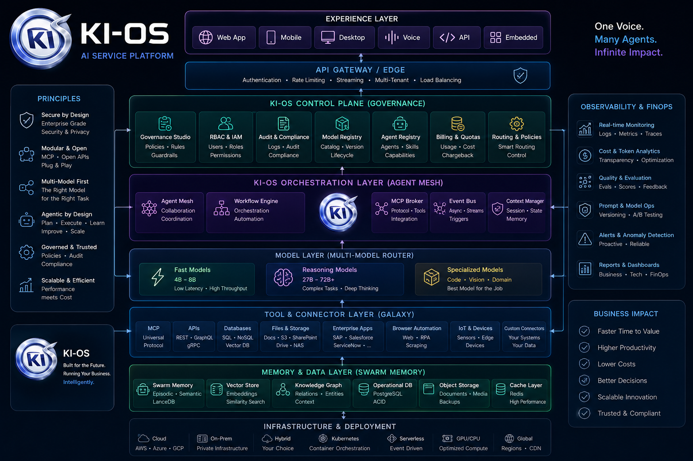

<div align="center">


<h1>KI-OS — The AI Operating System</h1>

<p><strong>The definitive runtime layer for models, agents, memory, and autonomous execution.</strong><br/>
We do not integrate AI tools. We are the sovereign system that runs them.</p>

[](https://github.com/KI-OS-org/ki-os/releases)
[](LICENSE-AGPL)
[](https://ki-os.org/book.html)
[](#)

<br/>

[Website](https://ki-os.org) · [Live Demo](https://ki-os.org) · [Documentation](docs/COMMUNITY_API.md) · [Contact Sales](mailto:enterprise@ki-os.org) · [The Book](https://ki-os.org/book.html)

</div>

---

## The AI Operating System — Now Also an AI Service Platform

KI-OS remains what it has always been: the open AI Operating System, built around local control, transparency, and extensibility. What's new is that the same runtime now also serves as an **AI Service Platform** — a single, coherent layer spanning experience, governance, orchestration, model routing, connectors, and memory, all working together instead of as isolated features. *(Full architecture breakdown in Pillar 6 below.)*

> *"One Voice. Many Agents. Infinite Impact."*

This isn't a cloud requirement. The Community Edition runs entirely on your own machine — no Kubernetes, no managed cloud, no external dependency required. Cloud, container orchestration, and multi-region deployment are options KI-OS supports for teams who choose to run their own infrastructure that way — never a prerequisite.

Layered on top of this platform, KI-OS has also grown from a request-response tool into an ambient presence — one that watches your screen for context, remembers what you did weeks ago, speaks in a voice you can interrupt mid-sentence, reaches you wherever you already are, and quietly builds new capabilities for itself when it notices you doing the same thing three times.

| Capability | What It Means For You |
|---|---|
| Visual Timeline Memory | Remembers everything visible on your screen across time — searchable in natural language, with sensitive apps automatically excluded. |
| Multi-Channel Presence | Reaches you on WhatsApp, Signal, iMessage, Telegram, and Discord so the conversation continues wherever you already are. |
| Autonomous Skill Discovery | Detects your recurring work patterns and proposes reusable skills you can approve once — the system keeps and improves them. |
| Secure Third-Party Skills | Imports skills from others and executes them in a fully isolated environment — every skill is scanned before it ever runs. |
| Interruptible Voice & Avatar | Lets you cut in mid-sentence while the avatar reacts with genuine emotional response instead of a static expression. |
| Unified Mission Control | Gives you one dashboard over every local model, cloud API, and installed skill with automatic, privacy-aware routing. |

---

## What "Operating System" Actually Means Here

A normal operating system doesn't run your applications for you — it manages the
resources they all need: CPU time, memory, disk, processes, permissions. Without
it, every application would have to reinvent scheduling, memory management, and
device drivers on its own.

KI-OS does the same job, one layer up. Every AI tool you use — a chat model, a
browser agent, a voice assistant, a third-party skill — needs the same underlying
resources: which model to call and at what cost, where to store what it learned,
who is allowed to run what, and how to reach you. Today, every tool solves that
separately. None of them talk to each other. None of them remember what the
others learned. None of them enforce the same security policy.

KI-OS is the layer underneath all of them:

| Resource every AI tool needs | Without KI-OS | With KI-OS |
|---|---|---|
| **Which model to use** | Hardcoded per tool, no fallback | Routed automatically by cost/latency/privacy — one call, any model |
| **What it learned** | Lost when the session ends | Persisted in Swarm Memory, shared across every agent |
| **What it's allowed to do** | Trust the vendor, or don't use it | Scanned and sandboxed before first run (ClawHub layer), scored daily against your own codebase's baseline (German Shepherd) |
| **Where it reaches you** | One app, one channel | WhatsApp, Signal, iMessage, Telegram, Discord — same agent, your choice of channel |
| **Where your data lives** | Wherever the vendor's servers are | On your machine, by default, permanently — not a setting you can accidentally turn off |

None of this requires you to change how you already work with AI — you still
type a message or say a sentence. What changes is what happens to it afterward:
it gets routed, remembered, governed, and made available everywhere you are,
instead of evaporating the moment the chat window closes.

---

## Current Documentation

For the current verified system view, start with `docs/CURRENT_STATE.md`.
For historical sprint, release, and handoff material, use `docs/ARCHIVE_GUIDE.md` before relying on older documents.

---

## The 365-Day Advantage

> *"Not the best assistant on day one. The only one that's irreplaceable on day 365."*

Every mission, every sprint, every decision feeds a personal intelligence layer that compounds over time. Swarm Memory learns your routing preferences. German Shepherd learns your codebase DNA. The A2A network deepens with every connected agent. A competitor starting today has none of this history — and cannot buy it.

**Features are replicable in nine months. Accumulated intelligence is not.**

---

## The Architectural Manifesto

> *"This book is an invitation. Not to treat KI-OS as a tool. But to treat it as operational intelligence."*

The AI Era demands a massive shift from pure experimentation to relentless, scalable execution. KI-OS is the foundational layer that turns generative noise into robust corporate infrastructure. By fully abstracting models, agents, memory, and governance, KI-OS creates an immutable, highly stable environment for autonomous work at enterprise scale.

**We are moving past the era of prompt engineering. We are entering the era of AI systems engineering.**

---

## The End of AI Chaos

Most organizations don't have an AI problem. They have a **catastrophic AI chaos problem** — isolated tools, zero coordination, automations that break with every model update.

| BEFORE | AFTER |
|---|---|
| 12 disconnected tools | 1 unified execution system |
| 5 fragile APIs | Swarm intelligence |
| Broken workflows | Complete data sovereignty |
| Zero memory | Production-grade workflows |

KI-OS sits securely between your workforce and the fragmented AI landscape — routing intelligently, remembering context, enforcing governance, and orchestrating agents that **actually finish what they start**.

> *"AI without orchestration is noise. AI with KI-OS becomes infrastructure."*

---

## Where KI-OS Stands

| | **KI-OS** | LangGraph | CrewAI |
|---|:---:|:---:|:---:|
| Runs standalone out of the box | ✅ | ❌ library, you build the app | 🟡 CLI scaffold, still code-first |
| Built-in security guardian (daily code scan) | ✅ | ❌ | ❌ |
| Voice, Avatar & Screen Presence | ✅ | ❌ | ❌ |
| Local-first model routing¹ | ✅ | 🟡 bring-your-own | 🟡 bring-your-own |
| Open governance/compliance engine built-in | ✅ | ❌ | 🟡 Enterprise-only |
| Open A2A interoperability | ✅ | ❌ | ❌ |
| Persistent Swarm Memory across runs | ✅ | 🟡 bring-your-own | 🟡 bring-your-own |
| Open source (AGPL) | ✅ | ✅ MIT | ✅ MIT (core) |

> LangGraph and CrewAI are excellent orchestration *libraries* — they give you the building blocks, and you assemble the application around them. KI-OS is the application: multi-agent orchestration, governance, memory, voice, and screen presence, running out of the box, on your own machine.
>
> ¹ Fully true for the Community Edition. Business/Enterprise are self-hosted on your own infrastructure — your data never leaves it — but periodically validate a license key against `license.ki-os.org` (key only, never data).

---

## How It Works — The Six Core Pillars

### 1 — One Voice Agent: Multi-Model Routing

KI-OS evaluates every prompt in real-time and routes it to the optimal model — based on cost, latency, and reasoning depth. One unified interface. Any model. Automatic fallback.

<div align="center">
  
  <br/><br/>
  <a href="https://ki-os.org">▶ Live Demo on ki-os.org</a>
</div>

| Capability | Status |
|---|---|
| Multi-Model Execution Engine | BUILT-IN |
| Intelligent Real-Time Model Routing | ACTIVE |
| Cost, Latency and Quality Optimization | FULLY AUTOMATED |
| Model Failure Fallback System | SELF-HEALING |
| Parallel Multi-Model Execution | SUPPORTED |

**Flagship Fleet:** OpenAI GPT & o1 · Anthropic Claude · Google Gemini · DeepSeek V & R · Qwen Max · Meta Llama · Local / On-Premises (air-gapped)

---

### 2 — AgentMesh: Multi-Agent Orchestration

A living, breathing multi-agent runtime engineered for complex, multi-stage enterprise operations. Planner → Executor → Reviewer roles work in parallel with self-healing loops and autonomous agent-to-agent communication.

<div align="center">
  
  <br/><br/>
  <a href="https://ki-os.org">▶ Live Demo on ki-os.org</a>
</div>

| Capability | Status |
|---|---|
| Planner, Executor and Reviewer Roles | BUILT-IN |
| Supervisor Mesh Layer | SELF-RECOVERY |
| Self-Healing and Repair Loops | ADD-ON / INTEGRATED |
| Multi-Agent Parallel Runs | YES |
| Long-Running Stateful Workflows | YES |
| Autonomous Agent-to-Agent Communication | YES |

---

### 3 — Ghost Control: Autonomous Browser Agent

KI-OS v1.23.0 includes Ghost Control as a core autonomous browser agent pipeline. A Planner decomposes goals into steps, an Executor performs real browser actions, and a Vision module validates each result. If validation fails, the system re-plans automatically.

<div align="center">
  
  <br/><br/>
  <a href="https://ki-os.org/ghost-demo.html">▶ Interactive Ghost Control Demo →</a>
</div>

| Capability | Status |
|---|---|
| Goal → Plan decomposition (Planner Agent) | BUILT-IN |
| Browser action execution (Executor Agent) | BUILT-IN |
| Vision-based step verification | BUILT-IN |
| Automatic re-planning on failure | SELF-HEALING |
| No Selenium / no Playwright dependency | NATIVE |

---

### 4 — Galaxy Connectors: Enterprise Execution

Universal connector layer that bridges AI agents to any enterprise system — from SAP to Slack to your custom webhook — without writing glue code.

<div align="center">
  
  <br/><br/>
  <a href="https://ki-os.org">▶ Live Demo on ki-os.org</a>
</div>

| Category | Systems |
|---|---|
| Enterprise AI | SAP Joule · Salesforce Agentforce · M365 Copilot · ServiceNow GenAI |
| ERP | SAP S/4HANA · Oracle ERP |
| CRM | Salesforce · HubSpot · Pipedrive · Microsoft Dynamics |
| Collaboration | Jira · Confluence · Slack · Teams · Google Workspace |
| Automation | n8n · Zapier · Make · Custom Webhooks |
| Data & Analytics | Snowflake · BigQuery · Databricks · S3 · Azure Blob |

---

### 5 — Swarm Intelligence: The Memory Layer

KI-OS memory is a hybrid architecture. The Community Edition provides local data sovereignty for individual use. The Business Edition runs a self-hosted central KI-OS server — your team shares one memory, your data never leaves your infrastructure. Both editions are built on the same sovereignty principle: **your data stays where you put it.**

<div align="center">
  
  <br/><br/>
  <a href="https://ki-os.org">▶ Live Demo on ki-os.org</a>
</div>

| Capability | Status |
|---|---|
| Persistent Vector Memory Store (LanceDB) | BUILT-IN |
| Cross-Run Learning and Pattern Reinforcement | YES |
| Shared Swarm Memory Across All Agents | YES |
| Confidence Scoring and Anti-Pattern Detection | YES |

---

### 6 — AI Service Platform: One Control Layer for Every AI You Use

KI-OS automatically routes every request to the optimal backend — whether local models via Ollama or MLX, cloud APIs through OpenRouter, Anthropic or OpenAI, or external agents and skills — based on cost, privacy requirements and output quality. A unified Service Catalog lets users enable or disable individual services such as Briefing, Research or Watch at any time, while the Control Plane provides live visibility into all connected backends.

<div align="center">
  
  <br/><br/>
  <a href="https://ki-os.org/ai-service-platform.html">▶ Explore the full architecture on ki-os.org</a>
</div>

| Capability | Status |
|---|---|
| Service Catalog (enable/disable individual AI services) | ACTIVE |
| Control Plane (live backend availability: local + cloud) | ACTIVE |
| Cost, Privacy and Quality-Aware Routing | FULLY AUTOMATED |
| Local Models (Ollama/MLX) + Cloud APIs (OpenRouter, Anthropic, OpenAI) — Unified | SUPPORTED |
| Third-Party Skill Execution (sandboxed by default) | BUILT-IN |

---

## German Shepherd — Your Built-in Security Guardian

> *"The only AI OS with a security agent that learns your codebase — not just the rules."*

German Shepherd runs daily. After months of scans it builds a behavioral baseline specific to your project: what is normal for your code, which dependencies you use, which patterns are yours. Threats are caught not only by generic CVE databases, but by **deviation from your own pattern**.

| Layer | Coverage |
|---|---|
| **Code rules** (S001–S012) | Shell-injection · SQL-injection · Hardcoded secrets · eval() · Path-traversal · CORS · JWT · Rate-limiting · HTTP leaks · License bypass |
| **CVE Layer 1–4** | npm audit · OSV.dev · NVD/NIST · GitHub Advisory |
| **CVE Layer 5–6** | RSS security feeds · Gemini web search for zero-days |
| **Ampel system** | KRITISCH / HOCH / MITTEL / NIEDRIG — Telegram alerts + `--approve` autofix |

In a world where Recall is "still radioactive" and Operator leaves no audit trail — German Shepherd is the transparent, auditable security layer that runs every morning, locally, without cloud.

---

## Governance & Trust: Adaptable Compliance

> *"Governance by Design — The five building blocks: Governance Check, Privacy Mask, Memory Retrieve, Connector Call, Approval Step."*

The EU AI Act framework is natively built-in but remains fully adaptable. KI-OS allows you to self-configure Governance and Trust settings according to your specific compliance requirements. Every prompt, agent decision, and API call is filtered through your customized policy engine — including military-grade PII masking and human-in-the-loop approval gates.

### Compliance & Certifications

| Standard | Status | Details |
|---|---|---|
| **DSGVO (GDPR)** | ✅ Compliant | Data sovereignty, PII masking, audit logs, right to erasure |
| **EU AI Act** | ✅ Adaptable | Basic (Community) → High-Risk Ready Art. 9–15 (Enterprise) |
| **ISO 27001** | 🔄 In Progress | Security controls implemented, certification pending |
| **SOC 2 Type II** | 🔄 Planned | 2026 Q3 target |
| **BSI C5** | 🔄 Planned | 2026 Q4 target |

### Security Features

- ✅ **Data Sovereignty:** All data stays on your hardware (Community/Business) or explicitly contracted managed hosting (Enterprise)
- ✅ **PII Masking:** Military-grade personally identifiable information masking with reversible tokens
- ✅ **Audit Logs:** Complete NDJSON audit trail for all agent decisions and API calls
- ✅ **Access Control:** SQLite + JWT (Community), OAuth 2.0 / OIDC / SAML 2.0 (Enterprise)
- ✅ **Multi-Tenant Isolation:** Database-level isolation for Enterprise deployments
- ✅ **Encryption:** AES-256 for data at rest, TLS 1.3 for data in transit

---

## KIMBA Earpiece, Voice & Desktop Control

### 🎧 KIMBA Earpiece System (vP6–vP8)

KIMBA hört passiv im Meeting mit, flüstert proaktive Hinweise per TTS (Aoede/Gemini) und erkennt Emotionen per Screenshot + Gemini Vision.

**Voraussetzungen (macOS):**
```bash
brew install ffmpeg          # Audio-Capture + Konvertierung
npm install -g pm2           # Prozess-Manager für Auto-Start
# BlackHole 2ch installieren: https://existential.audio/blackhole/
# Systemeinstellungen → Datenschutz → Bildschirm- & Systemtonaufnahme → Terminal ✓
```

**Features:**
- ✅ **VAD:** Whisper-Erkennung (-40 bis -25 dBFS), Sprachsegmentierung
- ✅ **STT:** OpenAI Whisper für Transkription
- ✅ **Opinion Engine:** Stilles Trigger-Wort `hmmm` → KIMBA analysiert Meeting und flüstert Meinung zurück (max. 12 Wörter)
- ✅ **Emotion Observer:** Screenshot alle 20s + bei Audio-Signal → Gemini Vision erkennt Gemütszustände der Teilnehmer
- ✅ **TTS:** Gemini 2.5 Flash + Aoede-Stimme — echtes Flüstern via `Say in a very quiet whisper...`-Prefix
- ✅ **HARDRULE:** Audio-Isolation — KIMBA ist niemals im Meeting-Kanal hörbar (`OVERRIDABLE=false`)

### 🎙️ Wake Word Voice Loop (vJ3)

Sage **„KIMBA"** — KIMBA hört zu, transkribiert, antwortet direkt per Sprache zurück.

```bash
npm run voice               # Manuell starten
pm2 start ecosystem.mac.config.js   # Mit KI-OS starten (Auto-Restart)
```

State Machine: `IDLE → WAKE_CHECK → RECORDING → TRANSCRIBING → KIMBA antwortet`

### 🖥️ Desktop Control (vD3)

```bash
# macOS: Screen Recording Permission aktivieren
open "x-apple.systempreferences:com.apple.preference.security?Privacy_ScreenCapture"
# Terminal hinzufügen → Schalter Ein
```

- ✅ macOS Swift-Helper (kompiliert automatisch via `xcrun swiftc`)
- ✅ Windows PowerShell-Adapter
- ✅ Screenshot, Maus, Keyboard, App-Launch, Clipboard
- ✅ `DESKTOP_CONTROL_ENABLED=true` in `.env` zum Aktivieren

---

## Skills System, Energy-VAD Voice & Mobile App

### 🔧 KIMBA Skills Registry (vJ3)

`*.skill.js`-Dateien im `skills/`-Verzeichnis werden beim Start automatisch geladen und per Keyword oder Name aufrufbar:

```bash
GET  /api/skills              # alle Skills auflisten
POST /api/skills/invoke       # { "name": "server-info" }
POST /api/skills/invoke       # { "query": "wie viel RAM?" }  ← Freitext-Routing
```

Built-in: `health-check` · `server-info` · `git-status` · `kimba-briefing`

Eigener Skill: `skills/mein-skill.skill.js` mit `name`, `description`, `triggers[]`, `execute()` anlegen → wird automatisch registriert.

### 🌐 External Skills API (vJ4)

```bash
POST /api/skills/install    { "source": "npm:@ki-os/skill-weather" }
POST /api/skills/install    { "source": "git:https://github.com/ki-os-org/skill-x" }
GET  /api/skills/installed
DELETE /api/skills/uninstall/:name
```

Sicherheit: npm-Allowlist (`@ki-os/skill-*`), git-Domain-Whitelist (`SKILL_GIT_DOMAINS` env), 10s Timeout-Guard.

### 🎙️ Energy-VAD Voice Loop (vV1)

Der Voice Loop erkennt jetzt das echte Ende der Rede statt fixer 4s-Chunks.

State Machine: `CAL → SIL → VOI → HLD`
- 2s Kalibrierung → dynamischer Baseline-Pegel + 6 dB Threshold
- Min. Sprachlänge 200ms (kein Zufalls-Trigger), Hold-off 300ms, Max 30s

```bash
node scripts/voice-loop.mjs --device 1
```

### 📸 Screenshot Capture (vD2)

```bash
node scripts/capture-screenshots.mjs --out output/screenshots/snap.png
node scripts/capture-screenshots.mjs --sequence scripts/seq.json     # Sequenz
node scripts/capture-screenshots.mjs --interval 3000 --count 5       # Timed
CAPTURE_DISPLAY=2 node scripts/capture-screenshots.mjs --out s2.png  # Multi-Monitor
```

### 📱 Mobile App — 9 Screens (Business/Enterprise)

Alle Screens jetzt im PagerView eingebunden:

`⚡ TOWER` · `◉ KIMBA` · `◈ DECK` · `▷ CMD` · `⊞ FILES` · `☰ LOG` · `◇ MEM` · `▶ DEMO` · `⚙ SYS`

Swipe-Navigation horizontal, BottomNav zeigt Label nur beim aktiven Tab.

---

## Channels, Voice & AI Services

### 💬 Discord Bridge (vJ1)

KIMBA lebt als vollwertiges Discord-Mitglied — freier Chat, Slash Commands, Datei-Zugriff und Shell-Ausführung direkt aus Discord.

```bash
# Slash Commands (überall im Server)
/claude <frage>     # KIMBA via Claude Code CLI
/codex  <frage>     # KIMBA via OpenAI Codex
/qwen   <frage>     # KIMBA via Qwen3

# Freier Chat: @KIMBA wie ein Teammitglied ansprechen
# Tools: read_file, run_command (Shell-Zugriff auf den Mac)
```

Voraussetzungen: `DISCORD_BOT_TOKEN`, `DISCORD_CLIENT_ID`, `DISCORD_GUILD_ID` in `.env`.
Auto-Start: LaunchAgent `org.ki-os.discord` (macOS).

### 📱 Telegram Bridge (vJ1)

```bash
!claude  <frage>    # Claude Code CLI via Telegram
!codex   <frage>    # Codex via Telegram
!qwen    <frage>    # Qwen via Telegram
```

KIMBA sendet automatisch Morning Briefing (08:00) und Abend-Report (19:00) via Telegram.
Voraussetzung: `TELEGRAM_BOT_TOKEN` in `.env`.

### 💬 WhatsApp Integration

Zwei Kanäle parallel:
- **Twilio Inbound** (`POST /api/whatsapp/inbound`) — eingehende Nachrichten als Mission-Seeds
- **Meta Cloud API** (`GET /api/whatsapp/meta/verify` + `POST /api/whatsapp/meta/inbound`) — kein Twilio nötig

Voraussetzungen: `TWILIO_ACCOUNT_SID`/`TWILIO_AUTH_TOKEN` (Twilio) oder `WHATSAPP_META_TOKEN`/`WHATSAPP_PHONE_ID` (Meta).

### 🎤 Voice Cloning (vVOICE-4)

KIMBA spricht in der Stimme des Nutzers — Stimme einmal enrollen, dann alle Antworten in dieser Stimme.

```bash
# CLI
kios voice-clone enroll --file meine-stimme.wav --user ingo
kios voice-clone say "Guten Morgen, hier ist KIMBA" --play
kios voice-clone list
kios voice-clone delete --user ingo

# API
POST /api/voice-clone/enroll       { userId, audioBase64, mimeType }
POST /api/voice-clone/synthesize   { userId, text }
```

### 🌐 OpenAPI-to-MCP Bridge (vMCP-1)

Jede REST-API wird automatisch zum KIMBA-Tool — OpenAPI-Spec einreichen, sofort als MCP-Tool verfügbar.

```bash
POST /mcp/bridge/register   { id: "my-api", spec: { openapi: "3.0", ... } }
GET  /mcp/bridge/tools      # alle registrierten Tools
POST /mcp/bridge/execute    { toolId, input }
GET  /mcp/bridge/specs      # alle registrierten Specs
DELETE /mcp/bridge/spec/:id
```

### 🏢 Agent 365 (vA365-3)

KIMBA als Microsoft Teams/Outlook/Word Teammitglied — per @Mention erreichbar.

```bash
POST /api/agent365/message    # Teams/Outlook Webhook-Eingang
GET  /api/agent365/manifest   # Agent-Manifest für Microsoft Azure Bot
GET  /api/agent365/status
```

Voraussetzung: `AGENT365_WEBHOOK_SECRET` in `.env` + Azure Bot-Registrierung.

### 🎵 Audio Cache & Voice Library (vA1/vA2)

- **vA1**: Semantischer TTS-Cache — generierte Audio-Fragmente werden wiederverwendet statt neu synthetisiert
- **vA2**: 216 MP3s in 8 KIMBA-Charakteren (synthesizer, supervisor, planner, execution, research, reviewer, memory, policy) für sofortige Offline-Wiedergabe

```bash
GET  /api/audio-cache/lookup?text=...    # Cache-Treffer prüfen
POST /api/audio-cache/store              # Neue Phrase cachen
GET  /api/audio-cache/stats              # Cache-Statistiken
```

### 🌙 KIMBA Dreaming

Täglich um 03:00 Uhr analysiert KIMBA autonom die Session-Handoffs und Swarm-Memory der letzten 24h und erstellt einen strategischen Nacht-Report.

```bash
POST /api/kimba/dreaming/run       # Manuell starten
GET  /api/kimba/dreaming/report    # Letzten Report abrufen
```

Report wird in `.tmp/dreaming-report.json` gespeichert und kann per Telegram abgerufen werden.

### 🧠 KIMBA Intelligence (vK1)

KIMBA lernt Ingo's Arbeitsweise kontinuierlich und injiziert Nutzer-Kontext automatisch in jede Mission.

- **UserProfile**: Rolle, Präferenzen, Sprache, Arbeitszeiten
- **PatternAnalyst**: Erkennt wiederkehrende Aufgaben und schlägt Automatisierungen vor
- **UserContext-Injection**: Alle Modelle im Team kennen den Nutzer-Kontext ohne explizite Übergabe

```bash
kios analyze              # FRIDAY-Analyse manuell auslösen
GET /api/intelligence/profile
GET /api/intelligence/patterns
```

### 🎭 Mood-aware TTS (Earpiece)

KIMBA flüstert Antworten im Ton des Gesprächsmoments — nicht immer gleich laut und sachlich.

| Mood | Emotion | Beispiel |
|------|---------|---------|
| `ALERT` | dringend | „Achtung — der Kunde fragt nach dem Budget" |
| `CALM` | ruhig | „Alles läuft wie geplant" |
| `CURIOUS` | neugierig | „Interessant — das kenne ich noch nicht" |
| `EXCITED` | enthusiastisch | „Das ist ein Durchbruch!" |

Konfiguration: `MOOD_INTENSITY=0.8` in `.env`.

### 🧩 Ambient Sales Intelligence (vC0)

Autonomer Hintergrund-Vertrieb — KIMBA analysiert kontinuierlich CRM-Pipeline und stößt Outreach an.

```bash
kios sales pipeline           # Pipeline-Übersicht
kios sales contacts           # Kontakt-Liste
kios sales dispatch           # Outreach versenden

GET  /api/sales/pipeline
GET  /api/sales/contacts
POST /api/sales/contacts
POST /api/sales/dna/profile   # KIMBA-DNA importieren
POST /api/sales/dispatch      # Outreach via Kanal versenden
```

### 🖥️ VSCode Extension (IDE 1-5)

KI-OS direkt in VS Code — Mission-Tree, Budget-Statusleiste, Echtzeit-Streaming.

- **AgentTreeProvider**: Live-Ansicht aller laufenden Agents in der Sidebar
- **BudgetStatusBar**: Echtzeit-Kostenanzeige in der Statusleiste
- **MissionWebview**: Streaming-Panel neben dem Editor
- **Effizienz-Report**: Multi-Model vs. Solo nach Mission-Abschluss

```bash
# Lokal installieren (VSIX)
code --install-extension ki-os-2.0.0.vsix
```

### 🖥️ CLI — Vollständige Command-Übersicht

```bash
kios meeting start            # Earpiece Meeting-Modus starten
kios meeting end              # Meeting beenden
kios meeting status           # Meeting-Status + Emotionen
kios voice-clone enroll       # Stimme enrollen
kios voice-clone say <text>   # In eigener Stimme sprechen
kios analyze                  # FRIDAY Pattern-Analyse
kios search <query>           # Web-Suche via Tavily
kios plan <ziel>              # Ghost-Plan erstellen
kios sales pipeline           # CRM-Pipeline
kios skill list               # Skill-Registry anzeigen
kios ghost <plan>             # Ghost Control starten
kios efficiency               # Effizienz-Report
```

---

## ClawHub, Channel Parity, SkillForge & Timeline *(v1.23.0)*

### 🔥 ClawHub-Kompatibilitäts-Layer

Importiert Skills im OpenClaw-Format (SKILL.md mit Frontmatter oder openclaw.plugin.json). Vor Installation und Ausführung erfolgen Security-Scan und Permission-Risiko-Bewertung (grün/gelb/rot). Rot-Skills werden nicht installiert. Ausführung in Docker-Sandbox ohne Netzwerkzugriff, Read-Only-Filesystem und Ressourcenlimits.

```bash
kios claw scan ./mein-claw/
kios claw install ./mein-claw/
kios claw list
kios claw uninstall mein-claw
kios claw run mein-claw
```

```bash
POST /api/claws/scan
POST /api/claws/install
GET  /api/claws/list
GET  /api/claws/docker-status
POST /api/claws/run/:name
```

Sicherheit: Vor jeder Ausführung erneuter Scan, Sandbox mit `--network=none`, `--cap-drop=ALL`, Memory/CPU/PID-Limits.

### 💬 Channel-Parität — Signal & iMessage

Ergänzt bestehende Bridges um Signal (via signal-cli) und iMessage (AppleScript + macOS Messages). Beide sind Single-User-Gate. Nachrichten von nicht autorisierten Kontakten werden ignoriert.

```bash
kios channel add signal
kios channel start signal
kios channel status
kios channel send signal +49123456789 "Nachricht"
```

```bash
GET  /api/channels/status
POST /api/channels/:name/start
POST /api/channels/:name/stop
POST /api/channels/:name/send
```

### 🧠 SkillForge — Selbstlernende Skills

Protokolliert Team-Tasks und erkennt wiederkehrende Tool-Sequenzen. Ab 3 Wiederholungen wird ein wiederverwendbarer Skill vorgeschlagen. Vorschläge erfordern manuelle Freigabe. Optional mit LLM-Verbesserung, immer mit deterministischem Fallback.

```bash
kios skillforge scan
kios skillforge proposals
kios skillforge approve skill-vorschlag-123
kios skillforge reject skill-vorschlag-123
```

```bash
POST /api/skillforge/propose
GET  /api/skillforge/proposals
POST /api/skillforge/proposals/:id/approve
```

### 📜 Timeline — Durchsuchbare Bildschirm-Historie

Erweitert Screen-Watch um eine durchsuchbare Historie (NDJSON, optional LanceDB). Privacy-First: App-Blacklist standardmäßig aktiv. Einträge können zeitbasiert gelöscht werden.

```bash
kios timeline recent
kios timeline search "Fehlermeldung gestern"
kios timeline blacklist
kios timeline delete --from 2025-04-01 --to 2025-04-02
```

```bash
GET  /api/timeline/recent
GET  /api/timeline/search
POST /api/timeline/blacklist/add
POST /api/timeline/delete-range
```

---

## Agent-Runtime — Hierarchische Teams, Browser-Automation & Auto-Learning

**Hierarchische Teams, Browser-Automation & Auto-Learning**

### 🌐 Browser-Use Tool (Playwright + Firecrawl)

**Autonome Browser-Interaktion für KI-Agenten.**

KI-OS kann jetzt Webseiten öffnen, navigieren, klicken, Text eingeben, Screenshots machen und Inhalte scrapen. Vollständig integriert mit Firecrawl für Web-Suche und Scraping.

**Features:**
- ✅ **8 Browser-Tools:** `navigate`, `click`, `fill`, `screenshot`, `scroll`, `wait`, `scrape`, `search`
- ✅ **Security:** Domain-Allowlist, Rate-Limiting (10/Min), Timeout (30s)
- ✅ **Privacy:** Audit-Redaction für sensible Daten
- ✅ **Firecrawl-Integration:** Web-Scraping und Websuche
- ✅ **Graceful Shutdown:** Cleanup-Hooks bei Server-Stop

**Use-Cases:**
- Wettbewerbsanalyse (Preise scrapen)
- Formular-Ausfüllen (Automatisierte Anmeldungen)
- Screenshot-Dokumentation (Compliance)
- Web-Research (Über einfache Suche hinaus)

```bash
# Installation
npm install playwright
npx playwright install chromium

# .env (optional für Scraping)
FIRECRAWL_API_KEY=fc_xxx
```

---

### 🧠 Reflection-Engine (Auto-Optimization)

**Automatische Selbst-Optimierung nach jedem Agent-Run.**

KI-OS bewertet jetzt automatisch jeden Run und generiert Learnings für zukünftige Tasks. Das System lernt kontinuierlich dazu und wird mit jeder Ausführung besser.

**Features:**
- ✅ **Scorecard:** Quality (0.4), Cost (0.2), Latency (0.2), Tool-Choice (0.2)
- ✅ **LLM-basierte Reflection:** "Was gut? Was schlecht? Nächste Zeit besser!"
- ✅ **Swarm Memory Integration:** Learnings automatisch speichern
- ✅ **API-Endpoints:** `/api/reflection/evaluate`, `/api/reflection/learnings`, `/api/reflection/stats`
- ✅ **AgentMesh-Integration:** Automatisch nach jedem Run

**Learning-Format:**
```json
{
  "whatWorked": ["Web-Suche war präzise", "Memory-Recall relevant"],
  "whatFailed": ["Provider-Wahl zu teuer"],
  "nextTime": ["Verwende Qwen für ähnliche Tasks"],
  "savedCosts": 0.50,
  "improvedLatency": 2000
}
```

---

### 👥 Hierarchical Agents (Manager/Worker/Specialist)

**Team-basierte Agent-Architektur für komplexe Tasks.**

Statt einzelner Agenten arbeitet jetzt ein ganzes Team: Manager plant und delegiert, Worker führen aus, Specialists bringen Domain-Expertise ein.

**Rollen:**
- ✅ **MANAGER:** Empfängt Task, plant Subtasks, delegiert, synthetisiert Ergebnis
- ✅ **WORKER:** Führt generische Tasks aus (günstig, schnell)
- ✅ **SPECIALIST:** Domain-Experte (research, coding, writing, review)

**Bidding-System:**
- Worker bieten auf Tasks (Kosten vs. Qualität)
- Economic Router entscheidet basierend auf Score
- Winner nimmt Task

**API:**
```bash
POST /api/hierarchical/run      # Run starten
GET  /api/hierarchical/teams    # Verfügbare Teams
GET  /api/hierarchical/stats    # Team-Statistiken
```

**Use-Cases:**
- Marketing-Plan erstellen (Researcher + Writer + Reviewer)
- Code-Review (Coder + Reviewer + Tester)
- Data-Analysis (Analyst + Visualizer + Presenter)

---

## Edition Overview

KI-OS comes in three editions — each built on the same codebase, differentiated by scale, deployment, and compliance requirements.

### Community — Free & Open Source
**For developers, researchers, and individual builders.**

Local deployment only. Full AI operating system capabilities on your own hardware. **No data ever leaves your machine.** Licensed under AGPL-3.0.

> *"Build on the same runtime that powers enterprise deployments — without cost, without limits on what you create."*

### Business — Team Scale *(coming v2.0)*
**For teams and growing organizations.**

You run **your own** central KI-OS server — on-premise or in your own cloud. Team members connect to it. **All data stays in your infrastructure.** We provide the software and a license key. Nothing else.

The license key is validated periodically against `license.ki-os.org` — only the key is checked, never your data, never your agents, never your memory.

> *"Same data sovereignty promise. Now for your whole team. Your server. Your data. Our software."*

### Enterprise — Compliance-Ready *(coming v2.0)*
**For regulated industries and large organizations.**

Like Business — self-hosted by default. Optionally: managed hosting by KI-OS (explicitly contracted, EU data residency). OAuth 2.0 / OIDC / SAML 2.0, Multi-Tenant isolation, EU AI Act High-Risk compliance (Art. 9–15), dedicated SLA and support.

> *"Governance by design. Compliance out of the box. Your data — wherever you need it."*

---

## Edition Matrix

**Alle Editionen basieren auf dem gleichen Codebase — unterscheiden sich durch Skalierung, Deployment und Compliance.**

| Capability | Community | Business | Enterprise |
| :--- | :---: | :---: | :---: |
| **Core Runtime** | | | |
| Multi-Model Dynamic Routing | ✅ | ✅ | ✅ |
| Create Agents | ✅ Unlimited | ✅ Unlimited | ✅ Unlimited |
| Concurrent Agent Runs | 3 (local HW) | Unlimited | Unlimited Swarms |
| One Voice Agent (Multi-Model Routing) | ✅ | ✅ | ✅ |
| AgentMesh Multi-Agent Orchestration | ✅ | ✅ | ✅ |
| Ghost Control (Browser Automation) | ✅ | ✅ | ✅ Full |
| A2A Protocol (Agent-to-Agent) | ✅ | ✅ | ✅ + Enterprise Hub |
| **Browser-Use Tool** | | | |
| Browser Automation (Playwright) | ✅ 8 Tools | ✅ 8 Tools | ✅ 8 Tools + Advanced |
| Web Scraping (Firecrawl) | ✅ Basic | ✅ Standard | ✅ Premium |
| Domain Allowlist + Rate-Limit | ✅ | ✅ | ✅ + Custom Rules |
| **Hierarchical Agents** | | | |
| Manager/Worker/Specialist Roles | ✅ | ✅ | ✅ + Custom Roles |
| Bidding-System | ✅ Basic | ✅ Standard | ✅ + Priority Bidding |
| Economic Router | ✅ | ✅ | ✅ + Custom Policies |
| **Reflection-Engine** | | | |
| Auto-Optimization per Run | ✅ | ✅ | ✅ + Fleet Learning |
| Scorecard (Quality/Cost/Latency) | ✅ | ✅ | ✅ + Custom Metrics |
| Swarm Memory Integration | ✅ local | ✅ shared | ✅ fleet-wide |
| **Memory & Learning** | | | |
| Swarm Memory (LanceDB, ACO Decay) | ✅ local | ✅ shared | ✅ fleet-wide |
| Memory Sharing API | ✅ | ✅ | ✅ |
| Learned Routing (Outcome Scorecard) | ✅ local | ✅ team | ✅ fleet |
| **Agent Operations** | | | |
| Dynamic Roles + Capability Discovery | ✅ | ✅ | ✅ |
| Structured Handoff Protocol | ✅ JSON | ✅ +UI Viewer | ✅ +Approval Workflow |
| **Galaxy Connectors** | | | |
| Galaxy Connectors (Basic) | ✅ 10+ | ✅ 20+ | ✅ 30+ |
| Native Enterprise AI Connectors | ❌ | ❌ | ✅ (SAP Joule, Salesforce Agentforce) |
| ERP Connectors (SAP S/4HANA, Oracle) | ❌ | ❌ | ✅ |
| CRM Connectors (Salesforce, HubSpot) | ❌ | ✅ Selectable | ✅ Full |
| Collaboration (Jira, Slack, Teams) | ✅ Basic | ✅ Standard | ✅ Premium |
| Automation Platforms | ✅ n8n (self-hosted) | ✅ n8n (self-hosted), Zapier, Make, Adobe Workfront, Microsoft Power Automate | ✅ n8n (self-hosted), Zapier, Make, Adobe Workfront, Microsoft Power Automate |
| Social Media (Instagram, Facebook, TikTok, LinkedIn) | ❌ | ✅ Instagram, Facebook, TikTok, LinkedIn (all features) | ✅ Instagram, Facebook, TikTok, LinkedIn (all features + Ads Manager) |
| E-Commerce Platforms | ❌ | ✅ Shopify, WooCommerce, Magento, PrestaShop, Shopware | ✅ Shopify, WooCommerce, Magento, PrestaShop, Shopware |
| Payment Providers | ❌ | ✅ Stripe, PayPal, Square, Mollie, Adyen | ✅ Stripe, PayPal, Square, Mollie, Adyen |
| Marketing Platforms | ❌ | ✅ Mailchimp, ActiveCampaign, HubSpot, Marketo, Pardot | ✅ Mailchimp, ActiveCampaign, HubSpot, Marketo, Pardot |
| ERP Systems | ❌ | ✅ SAP, Oracle NetSuite | ✅ SAP, Oracle NetSuite |
| CRM Systems | ❌ | ✅ HubSpot CRM, Pipedrive, Salesforce, Zoho, Microsoft Dynamics | ✅ HubSpot CRM, Pipedrive, Salesforce, Zoho, Microsoft Dynamics |
| PIM/DAM Systems | ❌ | ✅ Akeneo, Pimcore, Bynder | ✅ Akeneo, Pimcore, Bynder |
| Analytics Platforms | ❌ | ✅ Google Analytics, BigQuery, Snowflake, Adobe Analytics | ✅ Google Analytics, BigQuery, Snowflake, Adobe Analytics |

> **✓ Integration Methods:** All platforms support API integration OR webhook triggers. Social Media platforms require respective API access tokens (Meta Developer, TikTok API, LinkedIn API). n8n is self-hosted in Community Edition.

---

## **Governance & Compliance**

| Capability | Community | Business | Enterprise |
|------------|-----------|----------|------------|
| Governance Module (Policy Packs) | Community pack | Custom YAML | Custom YAML + Audit |
| Risk Tiers (LOW/MEDIUM/HIGH/CRITICAL) | ✅ | ✅ | ✅ |
| Audit Events (NDJSON) | ✅ local | ✅ persistent | ✅ exportable |
| EU AI Act Compliance | Basic | Adaptable | High-Risk (Art. 9–15) |
| PII Masking | Basic | ✅ Pro | ✅ Military-Grade |
| **Data & Sovereignty** | | | |
| Data stays on your hardware | ✅ always | ✅ always | ✅ always |
| Optional managed hosting | ❌ | ❌ | ✅ explicitly contracted |
| License key validation | ❌ No key needed | ✅ key only | ✅ key only |
| **Auth & Deployment** | | | |
| Auth (SQLite + JWT) | ✅ | ✅ | ✅ |
| OAuth 2.0 / OIDC / SAML 2.0 | ❌ | ❌ | ✅ |
| Multi-Tenant Isolation | ❌ | ❌ | ✅ |
| Deployment | Local | Self-hosted | Self-hosted/managed |
| **SDK & Tooling** | | | |
| Python SDK (`pip install kios`) | ⚠️ Eingefroren, kein aktiver Support | ⚠️ Eingefroren | ⚠️ Eingefroren |
| Mobile App (React Native) | ❌ | ✅ Commercial | ✅ Commercial |
| C-Deck Command Cockpit | ✅ | ✅ | ✅ |

---

## 📸 Feature Screenshots & Demos

### 🌐 Browser-Use Tool

**Screenshots:**
- [Browser Navigation Demo](Web/browser-navigate.png) *(coming)*
- [Web Scraping Example](Web/browser-scrape.png) *(coming)*

**Live Demo:** [https://ki-os.org/browser-demo.html](https://ki-os.org) *(coming)*

---

### 🧠 Reflection-Engine

**Screenshots:**
- [Scorecard Dashboard](Web/reflection-scorecard.png) *(coming)*
- [Learning Timeline](Web/reflection-learnings.png) *(coming)*

**API Example:**
```bash
curl -X POST http://localhost:3000/api/reflection/evaluate \
  -H "Content-Type: application/json" \
  -d '{"runId": "xxx", "task": "...", "output": "..."}'
```

---

### 👥 Hierarchical Agents

**Screenshots:**
- [Team Structure](Web/hierarchical-team.png) *(coming)*
- [Bidding System](Web/hierarchical-bidding.png) *(coming)*

**Live Demo:** [https://ki-os.org/hierarchical-demo.html](https://ki-os.org) *(coming)*

---

## Installation

**Requirements:** Node.js 22 LTS · **NO API KEY REQUIRED** for Community Edition

> **Node.js is installed automatically** by the setup scripts if not present.
> **Community Edition runs completely locally without any API keys.** Add keys for cloud models when ready.

### Windows (Recommended)

```
1. Download ZIP from https://github.com/KI-OS-org/ki-os/releases/latest
2. Extract → double-click setup.bat    (installs Node.js + dependencies)
3. Double-click START-community.bat    (starts KI-OS → http://localhost:3000)
```

### Linux / macOS

```bash
# 1. Download & extract or clone
git clone https://github.com/KI-OS-org/ki-os.git
cd ki-os/dist/community

# 2. Run setup (installs Node.js 22 if missing, installs dependencies)
bash setup.sh

# 3. Start
bash KI-OS-Community.sh
# → http://localhost:3000
```

### Configure API Keys (Optional)

Add at least one provider key to `.env` (copy from `.env.example`):

```env
ANTHROPIC_API_KEY=sk-ant-...      # Anthropic Claude
OPENAI_API_KEY=sk-...             # OpenAI GPT / o1
OPENROUTER_API_KEY=sk-or-...      # 600+ models, single key
GEMINI_API_KEY=AIza...            # Google Gemini
```

> **Tip:** [OpenRouter](https://openrouter.ai) gives you Claude, GPT, Gemini, DeepSeek, Qwen and 600+ models with a single API key — ideal for getting started.

---

### Docker

```bash
cp .env.example .env   # add your API keys
docker compose up -d
# → http://localhost:3000
```

Full `docker-compose.yml` included — production-grade with health checks, persistent volume, and auto-restart:

```yaml
services:
  ki-os:
    image: ghcr.io/ki-os-org/ki-os:latest
    ports: ["3000:3000"]
    environment:
      - ANTHROPIC_API_KEY=${ANTHROPIC_API_KEY}
      - KI_OS_EDITION=community
    volumes:
      - ki-os-data:/app/data
    restart: unless-stopped
    healthcheck:
      test: ["CMD", "wget", "-qO-", "http://localhost:3000/health"]
      interval: 30s
      retries: 3
```

---

### Troubleshooting

| Problem | Solution |
|---|---|
| Port already in use | `START-community.bat` kills existing processes automatically |
| No API key set | **Community runs without keys!** Add keys for cloud models only |
| Node version error | Run `setup.bat` / `setup.sh` — auto-installs Node.js 22 LTS |
| `npm install` fails | Delete `node_modules/` and retry |
| UI doesn't load | Check that port 3000 is not blocked by firewall |

---

## API Reference

Base URL: `http://localhost:3000` · All responses: `application/json` · Every response includes `x-trace-id`

### System

```bash
GET  /health     # System health — runtime, memory, connectors, supervisor
GET  /ready      # Readiness probe (200 = ready)
GET  /status     # Full observability snapshot
GET  /metrics    # Runtime metrics — requests, tokens, latency
```

```bash
curl http://localhost:3000/health
# → { "status": "ok", "edition": "community", "checks": { "runtime": {...}, "connectors": { "total": 23 } } }
```

### Chat

```bash
POST /chat
```
```json
{ "message": "Summarize the Q1 sales report", "conversationId": "session-42" }
```
```json
{ "success": true, "reply": "...", "model": "claude-sonnet-4-5", "provider": "anthropic", "tokens": { "input": 18, "output": 94 } }
```

### AgentMesh — Multi-Agent Runs

```bash
POST   /api/agentmesh/runs          # Start a multi-agent run (Community: 3 concurrent / local HW)
GET    /api/agentmesh/runs          # List all runs
GET    /api/agentmesh/runs/:runId   # Get run status + step log
DELETE /api/agentmesh/runs/:runId   # Cancel run
```

### Handoff

```bash
GET    /api/handoff/:runId          # Structured handoff object for a run
```

### Dynamic Roles

```bash
GET    /api/roles                   # List all agent roles + capabilities
GET    /api/roles/:name             # Get specific role
POST   /api/roles/recommend         # Get recommended roles for a task description
```

### Governance

```bash
GET    /api/governance/status       # Current governance status (edition, policy pack)
GET    /api/governance/policy       # Active policy pack (allowed tools, cost limits)
POST   /api/governance/audit        # Write audit event
```

### Learned Routing

```bash
GET    /api/scorecard               # Outcome scorecard per provider/task type
POST   /api/scorecard/record        # Record a run outcome
GET    /api/scorecard/recommend     # Get routing recommendation for task + budget
```

### Autonomous Feature Intelligence

```bash
POST   /api/intelligence/scan                  # Scan AI sources for new features
GET    /api/intelligence/proposals             # List sprint proposals
PATCH  /api/intelligence/proposals/:id         # Update proposal status (pending → approved)
```

### License

```bash
GET    /api/license/status    # Current tier (community / business), limits, validUntil
POST   /api/license/refresh   # Trigger online validation against license.ki-os.org
```

```bash
curl -X POST http://localhost:3000/agentmesh/runs \
  -H "Content-Type: application/json" \
  -d '{ "task": "Research competitors and write a report", "agentIds": ["researcher","writer"], "maxParallel": 3 }'
```

### Memory (Vector Search)

```bash
POST /memory          # Store a fact
POST /memory/search   # Semantic search across all stored memory
GET  /memory/:key     # Retrieve specific entry
DELETE /memory/:key   # Delete entry
```

### Routing

```bash
POST /routing/resolve      # Preview which model KI-OS would select
GET  /routing/scorecards   # Live performance scores per provider
GET  /routing/decisions    # Full routing decision history
```

### Governance & Privacy

```bash
POST /governance/simulate   # Test a message against your policy engine
POST /privacy/analyze       # Detect PII in text
POST /privacy/mask          # Replace PII with tokens
POST /privacy/demask        # Restore original values
```

### Error Format

```json
{ "success": false, "error": "enterprise_only", "message": "This feature requires Enterprise Edition" }
```

| Code | Meaning |
|---|---|
| 200 | Success |
| 400 | Bad request |
| 403 | Enterprise only |
| 429 | Rate limited |
| 503 | Service down — check `/health` |

Full API reference: [docs/COMMUNITY_API.md](docs/COMMUNITY_API.md)

---

## Operator Guide

### Health & Monitoring

```bash
# Health check
curl http://localhost:3000/health

# Full status snapshot
curl http://localhost:3000/status

# Runtime metrics
curl http://localhost:3000/metrics
```

### Authentication

All API endpoints require identity headers:

```bash
# User role
curl -H "x-user-id: alice" -H "x-role: user" http://localhost:3000/chat

# Admin role
curl -H "x-user-id: admin" -H "x-role: admin" http://localhost:3000/admin/stats
```

### Environment Variables

| Variable | Default | Description |
|---|---|---|
| `PORT` | `3000` | Server port |
| `KI_OS_EDITION` | `community` | Edition flag |
| `NODE_ENV` | `production` | Runtime mode |
| `MEMORY_DRIVER` | `file` | `file` or `lancedb` |
| `EMBEDDING_PROVIDER` | — | `openai` for semantic search |
| `ALLOWED_ORIGINS` | `''` | CORS allow-list (comma-separated) |

### Optional: LanceDB Vector Memory

Upgrades memory from key-value to full semantic (embedding-based) vector search:

```bash
npm install @lancedb/lancedb
```

```env
MEMORY_DRIVER=lancedb
EMBEDDING_PROVIDER=openai
```

### npm Scripts

| Command | Description |
|---|---|
| `npm start` | Start KI-OS |
| `npm test` | Run full test suite (95 tests) |
| `npm run doctor` | System check — Node, dependencies, config |

---

## Architecture

KI-OS delivers absolute trust and stability through two rigorously decoupled systems:

<div align="center">
  
</div>

---

## The Book

**KI-OS: The Operating System for the AI Era** *(2nd Edition)*

The definitive architectural blueprint behind this codebase — the philosophy, the organizational transformation, and the proven framework for deploying AI at enterprise scale.

**Available worldwide: April 15, 2026** — [More Information →](https://ki-os.org/book.html)

---

## Built by Human × AI Co-Creation

KI-OS proves its own architectural claims. This entire system was engineered in a continuous, high-speed loop by **Ingo Schaffer** and **KIMBA** — the multi-model orchestrator running natively on KI-OS itself. KIMBA utilized its own Swarm Memory to build the very system it runs on.

> *Autonomous AI execution is not the future. It is the present.*

---

## Latest Community Release — v1.23.0 (July 2026)

**ClawHub-compatible skill execution, native channel parity, and the AI Service Platform** land in this release. Import third-party skills safely — every skill is security-scanned and runs sandboxed with no network access by default. Signal and iMessage join Discord, Telegram, and WhatsApp as native channels. SkillForge detects your team's recurring task patterns and proposes reusable skills. Timeline gives you a searchable, privacy-first history of what was on your screen. And the AI Service Platform ties it all together: one Service Catalog, one Control Plane, cost- and privacy-aware routing across every local and cloud backend you connect. Security: all previously open critical and high-severity dependency vulnerabilities have been resolved.

---

## 💬 Community

Questions, ideas, show-and-tell? Join us on Discord — that's where the conversation happens.

[](https://discord.gg/BfzqqdUy8)

For bugs and feature requests use [GitHub Issues](https://github.com/KI-OS-org/ki-os/issues).

---

<div align="center">

[Website](https://ki-os.org) · [Discord](https://discord.gg/BfzqqdUy8) · [Top 50 Use Cases](https://ki-os.org/TOP50-KI-OS.html) · [Contact Sales](mailto:enterprise@ki-os.org)

<br/>

Community Edition released under the **AGPL-3.0 License**.<br/>
Business and Enterprise components, including the React Native Mobile App, are released under a **commercial KI-OS license** only.<br/>
Copyright © 2026 Ingo Schaffer and the KI-OS Community.

</div>
